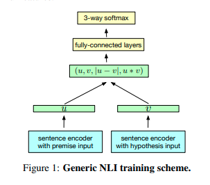
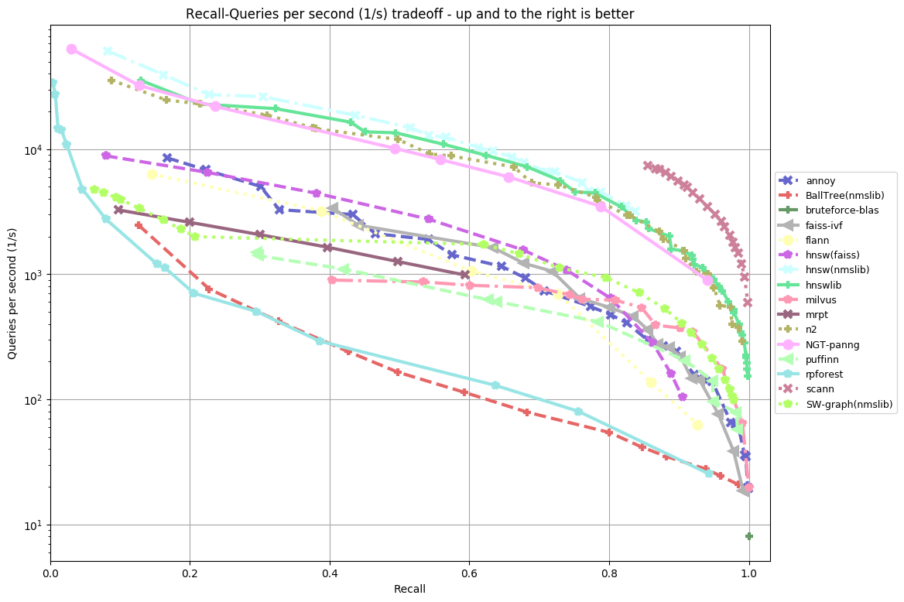

# Document similarity
## Write up of work so far

- James Singleton
- 5 October 2020

## Aims
- create document vectors for querying content gov.uk, using pre-trained models
- use cosine distances between document vectors to establish similarity between documents
- investigate self-organised maps, SOMs, to represent the entire government corpus on a single page

## Progress in a nutshell:
- contents are being parsed from the content store into clean text, removing (most) meta data
- document vectors are created using:
  + Universal Sentence Encoder v5 Transformer from Google
  + Universal Sentence Encoder v4 DAN from Google
  + Distilbert from SBERT library by Darmstadt Uni
- a trained nearest neighbour index is pre-calculated for subsequent efficient querying of database
  + ANNOY: Approximate Nearest Neighbour (Oh Yeah) from Spotify
  + FAISS: nearest neighbours from Facebook, more functionality, less user friendly
- for new text, similar documents can be found in the Approximate Nearest Neighbour tree
- for existing text, (near) duplicate documents are simply found using the distance metrics
- separately, Avision is working on SOMs, to highlight distinct areas of the whole gov.uk corpus related to a query - efficient display of insight, 'Seeing Rooms'

### Explainer - Universal Sentence Encoder
The Universal Sentence Encoder compresses a document into a dense vector, of length 512. The reason for doing this is it compresses the meaning of a document into a uniform and compact shape. The Universal Sentence Encoder is a pretrained model from Google, trained on a larger corpus of documents. Using this model is transfering learning from other documents to our documents. Positions on the vector represent abstract concepts, which are unrelated to each other. The magnitude of values for an attribute reflect its strength. The underlying models have been pre-trained on supervised learning tasks using Siamese networks to predict a gold standard similarity target.

### Explainer - Cosine angle
Vectors have direction and magnitude (to quote Despicable Me). For any two documents, represented as vectors, their similarity to each other can in part be expressed by the geometric angle between them. Basically, if the document vectors point in the similar direction, they are similar. The cosine operation removes the magnitude and looks solely at the direction. Using the cosine formula, which is the product of two vectors divided by their magnitudes, we find the similarity between documents. The cosine formula is actually the same as Pearson correlation for vectors which have been mean-centred.

### Explainer - Approximate Nearest Neighbours Oh Yeah
Approximate Nearest Neighbours solves the problem of speed of search for closely related terms.
Naively trying to find the nearest neighbours for an item, on a case by case basis, would require repeatedly calculating the n-1 pairwise relationships, where n is the number of documents. To circumvent this problem, the corpus can be mapped as a tree, beforehand, on a one time basis. The tree is built by repeatedly bisecting the search space. Its a very simple idea. Each time the space is bisected, the number of elements in the resulting two spaces is halved. In this way, an address in hyperspace is created for an item. This index tree is then saved for subsequent use when a query is run.

Then, once an item is queried, the nearest neighbours calculation is preceded by finding the relevant address space in the index tree. Then looking in the space (and neighbouring spaces if requested), and only calculating the nearest neighbours in that space. This speeds up the search time, in proportion to 2**number of branches to the tree. This is an established problem which Spotify has addressed, but for music recommendations (they compress music into embedding vectors too). The Spotify library (ANNOY - Approximate Nearest Neighbours Oh Yeah) is the most user friendly, so that has been used here. Indexation of the space is initially time consuming, but after that is completed, the search times are the order of milliseconds. A search is performed by expressing a document as the embedding vector.

## Example search and response

- Specify some search text (this could be a document someone is preparing for content).

`
test_text = ['Britain will roll out COVID-19 vaccinations when they are ready based on clinical advice about who should be prioritised, health minister Matt Hancock said on Monday, after a report that half the population could miss out on the jabs.',
'Asked about comments by the chair of the government\’s vaccine taskforce to the Financial Times that vaccines would probably only be available to less than half the UK population, Hancock said the taskforce had done good work in procuring vaccines but that deployment was his department\’s responsibility.',
'“We will take the advice on the deployment of the vaccine, based on clinical advice from the Joint Committee on vaccinations and immunizations,” Hancock told parliament.']
`

- Create an embedding vector for the query text:

`embedding = document_embedding(test_text)`

- Querying the ANN address ('u') list for related documents, using the embedding vector for the search document:

`print(u.get_nns_by_vector(embedding, 4, include_distances=True))`

- Which gives us the following list of documents and their distance from the query:

'([102071, 10357, 8167, 19281],
 [0.716115415096283, 0.7211982011795044, 0.7626693844795227, 0.8062140345573425])'

- We look at the first document:

`text_df['doc_text'][102071]`

`
'A deal to secure early access to a promising new coronavirus vaccine has been announced by the UK Government today (29 July), enhancing the UK’s growing portfolio of vaccine candidates to protect the public and to save lives. The agreement with GSK and Sanofi Pasteur, which combined have the largest vaccine manufacturing capability in the world, will supply the UK with 60 million doses of their Covid-19 vaccine, which is based on existing DNA-based technology used to produce Sanofi’s flu vaccine. If the GSK and Sanofi vaccine candidate is proven effective in human studies, the UK could be able to vaccinate priority groups, such as frontline health and social care workers and those at increased health risk, as soon as summer 2021.  Human clinical studies of the vaccine will begin in September followed by a Phase 3 study in December 2020. With today’s announcement, the UK Government has now secured early access to four different types of immunisation and a total of 250 million doses, giving the UK the most likely chance of finding a safe and effective vaccine at the quickest speed. Business Secretary Alok Sharma said: Our scientists and researchers are racing to find a safe and effective vaccine at a speed and scale never seen before. While this progress is truly remarkable, the fact remains that there are no guarantees. UK Government Minister for Scotland Iain Stewart said: This latest agreement comes as the UK Government confirmed that almost 72,000 people have volunteered to receive information about participating in future vaccine studies following the launch of the NHS Covid-19 vaccine research registry last week. Only large-scale clinical studies can give scientists and regulators the assurances they need that vaccines secured are safe and effective for use. That is why the Government is urging the British public to back the national effort to speed up vaccine research by signing up to www.nhs.uk/coronavirus to receive information about becoming a volunteer for clinical studies. The aim is to get 500,000 people signed up by October. Kate Bingham, Chair of the UK Government’s Vaccines Taskforce, said: ...
`
# References

Facebook paper from 2018 on Supervised Sentence Embeddings <https://arxiv.org/pdf/1705.02364.pdf>

Google paper from 2018 building on Facebook idea, USE <https://www.aclweb.org/anthology/D18-2029.pdf>

Darmstadt SBERT, building on USE <https://arxiv.org/pdf/1908.10084.pdf>
